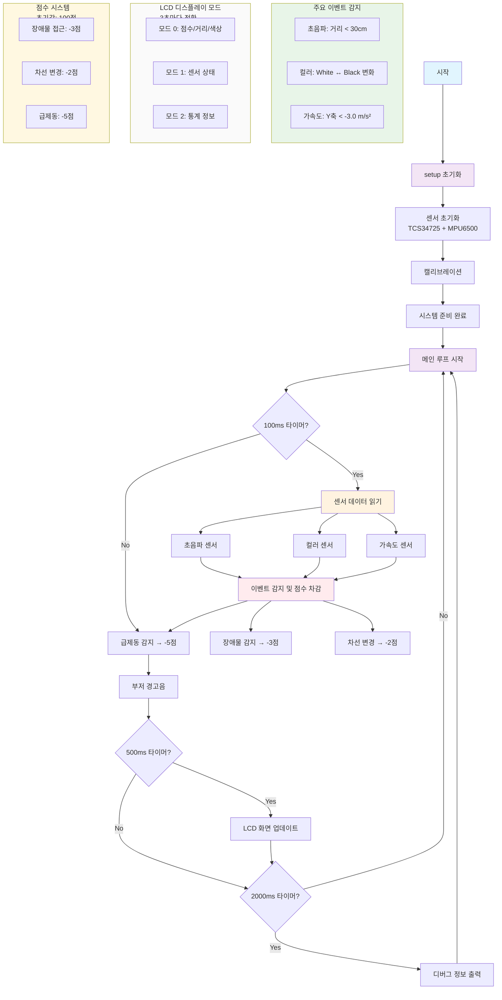

```mermaid
flowchart TD
    A[시작] --> B[setup 초기화]
    
    %% Setup 간소화
    B --> C[센서 초기화<br/>TCS34725 + MPU6500]
    C --> D[캘리브레이션]
    D --> E[시스템 준비 완료]
    E --> F[메인 루프 시작]
    
    %% 메인 루프
    F --> G{100ms 타이머?}
    G -->|Yes| H[센서 데이터 읽기]
    G -->|No| L
    
    %% 센서 읽기 그룹
    H --> H1[초음파 센서]
    H --> H2[컬러 센서]
    H --> H3[가속도 센서]
    H1 --> I
    H2 --> I
    H3 --> I
    
    %% 이벤트 처리
    I[이벤트 감지 및 점수 차감]
    I --> J[장애물 감지 → -3점]
    I --> K[차선 변경 → -2점]
    I --> L[급제동 감지 → -5점]
    
    %% 출력 처리
    L --> M[부저 경고음]
    M --> N{500ms 타이머?}
    N -->|Yes| O[LCD 화면 업데이트]
    N -->|No| P
    O --> P{2000ms 타이머?}
    P -->|Yes| Q[디버그 정보 출력]
    P -->|No| F
    Q --> F
    
    %% 주요 이벤트 상세
    subgraph Events[주요 이벤트 감지]
        E1[초음파: 거리 < 30cm]
        E2[컬러: White ↔ Black 변화]
        E3[가속도: Y축 < -3.0 m/s²]
    end
    
    %% LCD 디스플레이 모드
    subgraph Display[LCD 디스플레이 모드<br/>3초마다 전환]
        D1[모드 0: 점수/거리/색상]
        D2[모드 1: 센서 상태]
        D3[모드 2: 통계 정보]
    end
    
    %% 점수 시스템
    subgraph Score[점수 시스템<br/>초기값: 100점]
        S1[장애물 접근: -3점]
        S2[차선 변경: -2점]
        S3[급제동: -5점]
    end
    
    style A fill:#e1f5fe
    style B fill:#f3e5f5
    style F fill:#f3e5f5
    style H fill:#fff3e0
    style I fill:#ffebee
    style Events fill:#e8f5e8
    style Display fill:#fafafa
    style Score fill:#fff8e1
```
