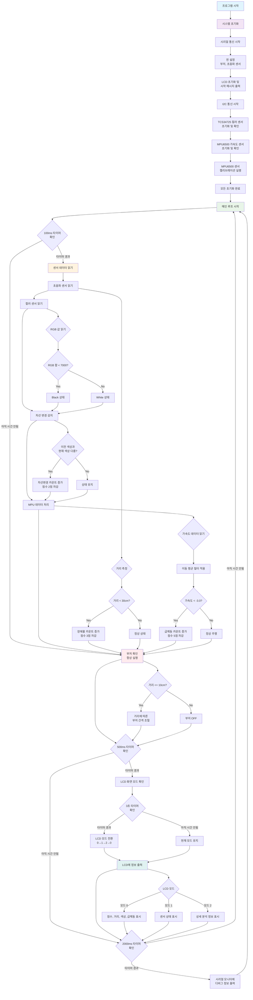

```mermaid
graph TD
    A[프로그램 시작] --> B[시스템 초기화]
    
    B --> B1[시리얼 통신 시작]
    B1 --> B2[핀 설정<br/>부저, 초음파 센서]
    B2 --> B3[LCD 초기화 및<br/>시작 메시지 출력]
    B3 --> B4[I2C 통신 시작]
    B4 --> B5[TCS34725 컬러 센서<br/>초기화 및 확인]
    B5 --> B6[MPU6500 가속도 센서<br/>초기화 및 확인]
    B6 --> B7[MPU6500 센서<br/>캘리브레이션 실행]
    B7 --> B8[모든 초기화 완료]
    
    B8 --> C[메인 루프 시작]
    
    C --> D{100ms 타이머<br/>확인}
    D -->|타이머 경과| E[센서 데이터 읽기]
    D -->|아직 시간 안됨| F[부저 확인]
    
    E --> E1[초음파 센서 읽기]
    E1 --> E2[컬러 센서 읽기]
    E2 --> E3[차선 변경 감지]
    E3 --> E4[MPU 데이터 처리]
    
    E4 --> F[부저 확인<br/>항상 실행]
    
    F --> G{500ms 타이머<br/>확인}
    G -->|타이머 경과| H[LCD 화면 모드 확인]
    G -->|아직 시간 안됨| K[디버그 타이머 확인]
    
    H --> H1{3초 타이머<br/>확인}
    H1 -->|타이머 경과| H2[LCD 모드 전환<br/>0→1→2→0]
    H1 -->|아직 시간 안됨| H3[현재 모드 유지]
    
    H2 --> I[LCD에 정보 출력]
    H3 --> I
    
    I --> K{2000ms 타이머<br/>확인}
    K -->|타이머 경과| L[시리얼 모니터에<br/>디버그 정보 출력]
    K -->|아직 시간 안됨| C
    L --> C
    
    %% 세부 함수들
    E1 --> U1{거리 측정}
    U1 --> U2{거리 < 30cm?}
    U2 -->|Yes| U3[장애물 카운트 증가<br/>점수 3점 차감]
    U2 -->|No| U4[정상 상태]
    U3 --> F
    U4 --> F
    
    E2 --> C1{RGB 값 읽기}
    C1 --> C2{RGB 합 < 7000?}
    C2 -->|Yes| C3[Black 상태]
    C2 -->|No| C4[White 상태]
    C3 --> E3
    C4 --> E3
    
    E3 --> LC1{이전 색상과<br/>현재 색상 다름?}
    LC1 -->|Yes| LC2[차선변경 카운트 증가<br/>점수 2점 차감]
    LC1 -->|No| LC3[상태 유지]
    LC2 --> E4
    LC3 --> E4
    
    E4 --> M1{가속도 데이터 읽기}
    M1 --> M2[이동 평균 필터 적용]
    M2 --> M3{가속도 < -3.0?}
    M3 -->|Yes| M4[급제동 카운트 증가<br/>점수 5점 차감]
    M3 -->|No| M5[정상 주행]
    M4 --> F
    M5 --> F
    
    %% LCD 모드별 표시
    I --> LCD1{LCD 모드}
    LCD1 -->|모드 0| LCD2[점수, 거리, 색상, 급제동 표시]
    LCD1 -->|모드 1| LCD3[센서 상태 표시]
    LCD1 -->|모드 2| LCD4[상세 분석 정보 표시]
    
    LCD2 --> K
    LCD3 --> K
    LCD4 --> K
    
    %% 부저 제어
    F --> BZ1{거리 <= 10cm?}
    BZ1 -->|Yes| BZ2[거리에 따른<br/>부저 간격 조절]
    BZ1 -->|No| BZ3[부저 OFF]
    BZ2 --> G
    BZ3 --> G
    
    style A fill:#e1f5fe
    style B fill:#f3e5f5
    style C fill:#e8f5e8
    style E fill:#fff3e0
    style F fill:#ffebee
    style I fill:#e0f2f1
```
